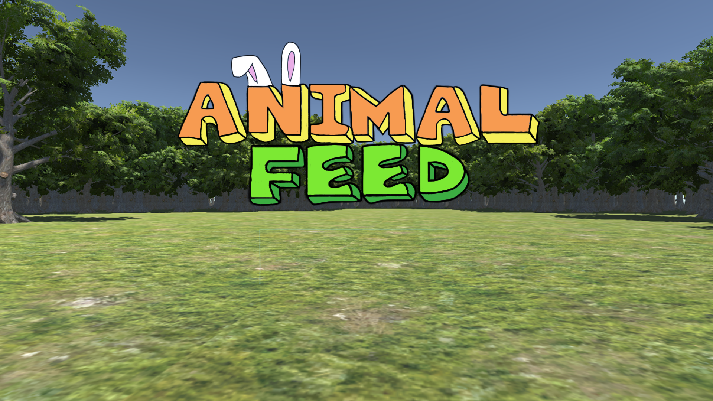
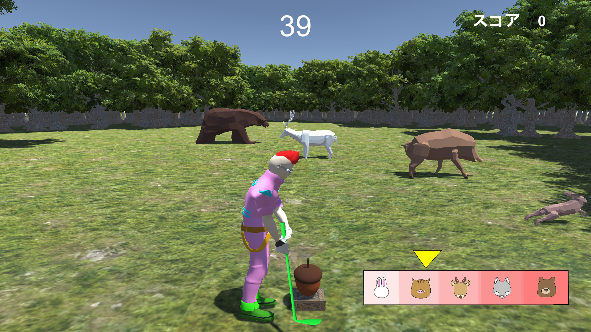
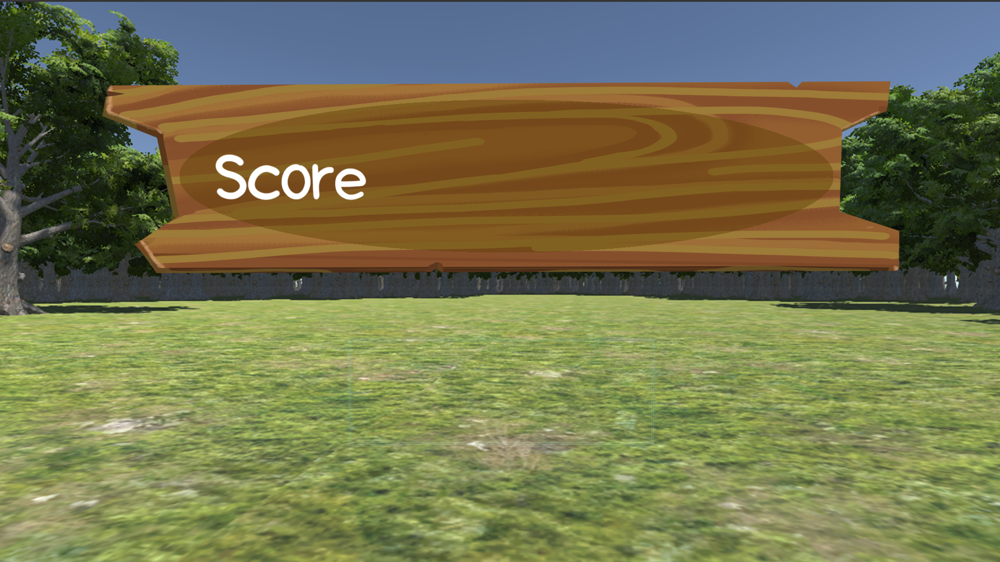

# AnimalFeed  

## ファイル構成  
* [Unityデータ](./testgame/)  
* [ビルドデータ]()  

## 概要  

## ジャンル  
タイミングゲーム

## プラットフォーム  
* [Androidビルドデータ]()  

## 担当ブログラムファイル  
* [クマとオオカミの判定](./testgame/Assets/Script/AnnimalScript/BearWolf.cs)  
* [シカとイノシシの判定](./testgame/Assets/Script/AnnimalScript/DeerBoar.cs)  
* [ウサギの判定](./testgame/Assets/Script/AnnimalScript/Hare.cs)  
* [食べ物を消す](./testgame/Assets/Script/fooddes.cs)  
* [ランダムにエサを出す](./testgame/Assets/Script/random.cs)  

## ゲームルール  
森を移動する動物に60秒間食べ物を与える。  

## Unityバージョン  
Unity 2018.4.2f1  

## 製作期間  
２か月

## メンバー（役割）  
* 小禄隆世（デザイナー）  
* 平良優斗（プログラマ）  
* 宮城沙耶（プログラマ）  

## ゲームスクリーンショット  
  
  
  